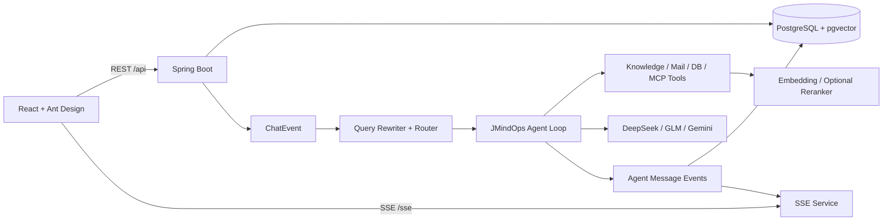

# JMindOps

一个基于 Spring AI 的智能运维与知识协同 Agent 平台。核心提供可解释的 ReAct 决策循环、多模型动态装配、混合检索 RAG、敏感工具协同审批与 SSE 响应式流式交互。

## 亮点

- **事件驱动与分布式协调**：用户消息落库后发布领域事件；基于 Redis Lua 脚本实现单会话 Single-Flight CAS 状态协调（带 5 分钟 TTL 自动防死锁），异步线程池接管推理。
- **多模型与动态装配**：支持 DeepSeek、智谱 GLM 和 Google Gemini；基于只读注册表（ChatClientRegistry）实现策略动态索引与上下文裁剪。
- **多格式 RAG 检索与批量评测闭环**：基于 Apache Tika 原生支持 PDF/Word/PPT/TXT/HTML 解析，结合 BGE-M3 密集向量 + 关键词倒排 + RRF 融合重排；提供批量 Golden Dataset 评测（支持 HitRate@K 和 MRR 效果量化）。
- **结构化输出自愈重试**：封装 `StructuredPromptExecutor`，意图分类异常时自动注入错误上下文触发 Repair Prompt 自愈重试。
- **人类在环（HITL）审批闭环**：高风险工具（邮件/数据库）触发审批拦截；前端在管理面板点击批准后，系统自动触发会话恢复指令，Agent 无缝继续执行并实时流式推流。
- **安全沙箱与超时防御**：数据库工具严禁写入，内置系统安全表（`app_user` 密码哈希、`tool_approval`）与凭证黑名单拦截；LLM 流式调用设置 60s 响应超时与单次生成 Token 预算熔断。
- **流式可观测交互**：模型分片实时推送；最终回答包含模型、耗时和 Token 使用信息。前端以 fetch-stream 携带 Authorization Header，并支持断线重连与历史对账。

## 架构



## 核心流程

1. 前端创建聊天会话并先建立带 Authorization Header 的 SSE 流，避免首轮流式内容在订阅前丢失。
2. 用户消息写入 `chat_message`，后端异步发布 `ChatEvent`。
3. `RouterAgent` 基于最近上下文完成问题改写和意图分类（CHAT / WEATHER / RAG / MCP）。
4. `JMindOpsFactory` 恢复记忆并按路由动态装配模型、知识库和工具。
5. 服务端为每轮生成分配 generationId，并在单 JVM 内对同一会话执行 single-flight；`JMindOps` 执行有上限的 LLM / tool loop，分片与最终结果通过事件持久化、推送。
6. 高风险工具会返回审批编号；用户在对话页批准后，让 Agent 根据原计划继续执行。

## 技术栈

| 层级 | 技术 |
| --- | --- |
| 前端 | React 19、TypeScript、Vite、Ant Design、Tailwind CSS |
| 后端 | Java 17、Spring Boot 3、Spring AI、MyBatis、WebClient |
| 数据 | PostgreSQL 15、pgvector、JSONB |
| AI 能力 | DeepSeek、智谱 GLM、Google GenAI、BGE-M3、MCP |
| 工程化 | Docker Compose、Nginx、SSE、AOP LLM Trace |

## 快速开始

### Docker Compose

1. 复制环境变量模板：`Copy-Item .env.example .env`（PowerShell）。
2. 编辑 `.env`：为数据库迁移账号设置 `POSTGRES_PASSWORD`，并为低权限运行账号设置不同的 `APP_DB_PASSWORD`；至少填入一种模型 API Key。RAG 需要提供可访问的 BGE-M3 服务。
   `APP_JWT_SECRET` 必须是长度至少 32 的随机字符串。需要演示管理能力时，设置 `APP_BOOTSTRAP_ADMIN_USERNAME` 和 `APP_BOOTSTRAP_ADMIN_PASSWORD`。
3. 启动：`docker compose up --build`。
4. 打开 `http://localhost:3000`。

Compose 会启动 PostgreSQL + pgvector、Spring Boot 和 Nginx。文档数据使用命名卷保留；本地嵌入模型并不内置在 Compose 中，因此通过 `RAG_EMBEDDING_BASE_URL` 显式配置。

数据库结构由 `jmindops/src/main/resources/db/migration` 下的 Flyway 脚本按版本自动迁移。对没有 Flyway 历史表的旧库，应用会以版本 `0` 建立 baseline，再执行幂等迁移；升级前仍应备份。`db-role-init` 会先创建或轮换低权限的 `jmindops_app` 运行账号。存量资源的 `owner_id` 会保持未认领状态，需要管理员显式迁移给某个用户后才会在界面中出现。

### 本地开发

- 后端：在 `jmindops` 目录配置环境变量后运行 `mvn spring-boot:run`。
- 前端：在 `ui` 目录运行 `npm ci`、`npm run dev`。Vite 会把 `/api` 和 `/sse` 代理到 `VITE_BACKEND_TARGET`（默认 `http://localhost:8080`）。
- 默认后端测试：`mvn test`，不会调用真实模型。需要执行 live 测试时，同时设置 `DEEPSEEK_API_KEY` 和至少 32 字节的 `APP_JWT_SECRET`，再运行 `mvn -Plive-tests test`；这会产生真实 API 调用和费用。

## 面试可讲的设计取舍

- **为什么不用同步 Controller 直接调用模型？** Agent 执行时长不可控。通过事件和异步线程池隔离 HTTP 请求，推理结果再由 SSE 回传，降低连接阻塞并让持久化、推流解耦。
- **如何降低多工具 Agent 的不确定性？** 先做 Query Rewrite + Intent Routing，只为当前意图装配必要的工具和上下文，降低无关工具调用和 Token 消耗。
- **为什么 RAG 需要混合检索？** 语义向量擅长召回近义表达，关键词检索适合专有名词、版本号等精确匹配；合并后可选用 reranker 提升最终排序质量。
- **流式回答如何保证体验？** 新会话先订阅 SSE，再提交首轮问题；事件携带 generationId 和 DONE/ERROR 终态，断线重连后以前端历史对账恢复一致性。
- **如何避免 Agent 越权执行？** 高风险工具被切面统一拦截，审批请求按用户、会话、工具参数指纹关联；批准后仅消费一次，并保留完整的状态和耗时审计记录。
- **怎么衡量 RAG 是否找对资料？** `POST /api/rag/evaluate` 接收问题和预期文档 ID，返回 Top-K 来源及命中结果；可基于真实业务题集统计 retrieval hit rate。

## 安全边界

项目已将密钥改为环境变量，真实 `.env` 不应提交。业务接口已接入 JWT、请求校验、限流和资源级所有者校验；知识库工具还会同时核对当前 Agent 的服务端 KB 白名单。邮件和数据库工具默认关闭，显式启用后仍要求管理员绑定及用户审批。Compose 将 Flyway owner 与低权限运行账号分离。生产化仍应把单机限流/single-flight 迁移到 Redis 或网关、为上传增加恶意内容扫描、为数据库工具使用独立只读数据源，并考虑 HttpOnly Cookie。已泄露到 Git 历史或第三方平台的密钥必须先在对应控制台轮换，再清理仓库历史。

## 目录

``` text
ui/          React 单页应用
jmindops/   Spring Boot、Agent、RAG、SSE 和 MyBatis
sql/init/    Compose 数据库运行账号初始化脚本
```
