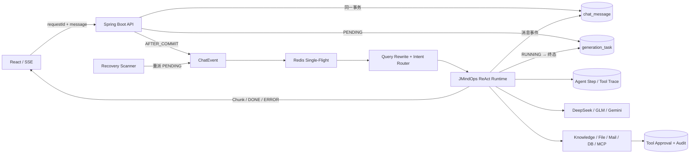

# JMindOps

JMindOps 不是一个只会“接模型、套聊天页面”的 Agent Demo，而是一个围绕 **可治理、可恢复、可评测** 三个工程问题构建的智能运维与知识协同平台。

它使用 Spring AI 实现可控的 ReAct 单步循环，支持动态 Agent 装配、混合检索 RAG、敏感工具审批和 SSE 流式交互；同时把每轮生成建模为持久任务，用幂等键、事务后派发、Redis single-flight 和恢复扫描处理重复请求、进程中断与事件丢失。V8 进一步把路由、每轮思考和工具调用保存为脱敏 Trace；V10～V11 引入 PostgreSQL Durable Document Index Task 实现高可用异步文档解析与分块索引；V12 进一步实现 Agent Step Checkpoint、Execution Ledger、WAITING_APPROVAL 挂起以及原位恢复（Same-Generation Resume）。

## 核心架构



### 一轮生成的状态与一致性

1. API 校验 JWT、资源所有权、会话与 Agent 绑定关系。
2. 查询 `(userId, requestId)`：相同指纹直接返回原任务；不同指纹返回 409。
3. 预占会话锁，将用户消息与 `generation_task(PENDING)` 放在同一数据库事务中。
4. 事务提交后才异步发布 `ChatEvent`；回滚时释放预占，避免“任务先跑、数据未提交”。
5. 消费者先通过 Redis Lua claim，再以条件更新把任务切为 `RUNNING`。重复事件无法重复 claim。
6. 成功写入 `SUCCEEDED`，异常写入脱敏后的 `FAILED`；客户端可查询状态，FAILED 可创建带父任务引用的新执行尝试。
7. 恢复扫描会重派长时间未消费的 PENDING；运行超时的 RUNNING 任务由分布式租约（Lease & Fencing）原子认领，并从最后一个安全 Checkpoint 自动恢复执行；敏感审批挂起为 `WAITING_APPROVAL`，审批完成后直接在原 generation 原位异步恢复，杜绝盲目判死或重复副作用。

该链路提供的是“**至少一次派发 + 幂等接入 + 条件状态迁移 + 会话单飞**”，没有宣称跨数据库与外部系统的 exactly-once。邮件等外部副作用仍应使用供应商幂等键或事务 Outbox 才能进一步收敛不确定性。

## Agent 与 RAG

- `RouterAgent` 先移除历史中重复的当前消息，仅对含指代的多轮追问做 Query Rewrite；路由采用“高置信规则优先、歧义输入交给模型”的混合策略，并区分“查询数据库中的知识库记录”和“检索知识库内容”。
- `JMindOps` 显式控制 `think → execute`，限制最大步数，并在工具执行边界绑定用户、会话、KB 白名单。
- `ToolAccessPolicy` 在工具描述发送给模型前执行确定性裁剪：危险 SQL 不暴露数据库工具，凭证读取/外传不暴露任何外部工具；“知识库步骤 + 工作区核查”可组合 `KnowledgeTool` 与只读 `readFile/listFiles`，写入类回调仍不可见。
- 每一步在模型调用前建立检查点，随后记录模型、Token、耗时、输出哈希与工具状态；工具执行中异常会标记为 `UNKNOWN`，避免把“可能已产生副作用”误报成普通失败。Trace 不保存原始 Prompt、工具参数或结果。
- 文档经 Apache Tika 解析清洗后切片；HTTP 上传不阻塞等待 Embedding，而是通过 PostgreSQL Durable Document Index Task（`FOR UPDATE SKIP LOCKED` + Lease Fencing + 指数退避）异步执行解析与索引写入；同名文件使用内容 SHA-256 和版本号增量更新，相同 chunk 复用 embedding，数据库事务原子切换新旧索引，删除文档时由外键级联清理 chunk。
- BGE-M3 向量召回与 ParadeDB `pg_search` 的 Jieba + BM25 倒排召回通过 RRF 融合。Rerank 是 `RagReranker` 扩展点，默认 Provider 为 `none`；可选 HTTP Provider 调用失败时，线上问答退化到确定性的 RRF 顺序。

### 可复现的 RAG 对照评测

`POST /api/rag/evaluate/compare` 可以让同一 Gold 题集在相同 Top-K 下比较 `VECTOR`、`HYBRID_RRF`，配置 Provider 后也可加入 `HYBRID_RERANK`：

```json
{
  "kbId": "<knowledge-base-uuid>",
  "modes": ["VECTOR", "HYBRID_RRF"],
  "topK": 3,
  "testCases": [
    {
      "query": "PostgreSQL 如何做向量检索？",
      "expectedDocumentIds": ["<document-uuid>"],
      "expectedKeywords": ["pgvector"]
    }
  ]
}
```

聚合结果中的 HitRate、Expectation Recall、Proxy Precision 使用百分数，MRR 使用 0～1；无答案题单独计算 No-answer Accuracy，P50/P95 使用毫秒。接口还返回相关性标签类型、每题命中排名、来源文档 ID、切片内容、evaluationId、知识库快照哈希、Embedding/Reranker 模型、完整非敏感检索配置以及配置 Hash。只有关键词标签时结果明确标记为 `KEYWORD_PROXY`，不能冒充标准文档相关性指标。Provider 为 `none` 时重排模式标记 `NOT_CONFIGURED`；已配置但调用失败才标记 `FAILED`，不会把 RRF 降级结果冒充成重排成绩。

`rag-test-v3.json` 是 100 题、人工复核并冻结的正式测试集。2026-09-11 在同一题集 Hash、知识库快照和检索配置下完成“预热 1 次 + 完整运行 3 次”，质量指标取三次中位数：

| 模式（Top-K=3） | HitRate@3 | Recall@3 | Precision@3 | MRR | 检索 P50 / P95 |
| --- | ---: | ---: | ---: | ---: | ---: |
| VECTOR | 72.50% | 77.84% | 24.58% | 0.575 | 68 / 75 ms |
| HYBRID_RRF | 76.25% | 81.49% | 25.83% | 0.656 | 77 / 84 ms |
| HYBRID_RERANK | **88.75%** | **89.53%** | **30.42%** | **0.831** | 1225 / 1362 ms |

相对纯向量基线，重排模式的 HitRate@3 提高 16.25 个百分点、Recall@3 提高 11.69 个百分点。端到端回答层的三次中位数为：整题通过率 44%、答案要点召回 61.75%、引用编号合法率 95%、被引证据覆盖率 93.69%、无答案准确率 85%，P50/P95 为 11.061/51.149 秒。这说明检索链路已有明显收益，但回答完整性和时延仍是主要优化项；这些确定性关键词/引用检查不等同于 RAGAS Faithfulness 或人工事实核验。

`scripts/run-rag-evaluation.ps1` 负责检索 A/B，`scripts/run-rag-answer-evaluation.ps1` 检查答案要点、KnowledgeTool、引用编号和被引证据关键词覆盖；`scripts/run-formal-rag-evaluation.ps1` 默认预热一次、完整重复三次并汇总中位数。Runner 会重新验证复核文件 Hash，并在回答评测前后核对 KB Snapshot 与检索配置。T2Ranking 结果使用带官方 qrels 的固定抽样子集，不等于官方全量语料或排行榜成绩。完整说明见 [`docs/evaluation/README.md`](docs/evaluation/README.md)。

### Agent Trace 与 AgentEval

`GET /api/generation-tasks/{generationId}/trace` 仅允许任务所有者读取，返回路由决策、当前步骤、累计 Token、检查点版本、每步模型耗时，以及工具调用的 `PREPARED / RUNNING / SUCCEEDED / WAITING_APPROVAL / FAILED / UNKNOWN` 状态。聊天页完成一次生成后可直接打开“查看执行轨迹”抽屉。

`evaluation-data/agent-eval-v2-dev.json` 是 40 题开发集，`evaluation-data/agent-eval-v2-test.json` 是 100 题、人工复核并冻结的正式测试集，覆盖路由边界、工具选择、多步骤执行、审批治理和安全拒绝。评分器不调用模型，只对实际运行导出的 Trace 观察结果做确定性复算：

```powershell
python scripts/score-agent-eval.py `
  --dataset evaluation-data/agent-eval-v2-test.json `
  --observed evaluation-results/agent-evaluation-20260910-140313-observed.json
```

有可用 Agent 与 JWT 后，可完整实跑并自动轮询每个 generation、拉取 Trace、生成 observed 与评分报告：

```powershell
.\scripts\run-agent-evaluation.ps1 `
  -AgentId <agent-uuid> `
  -Token <jwt>
```

开发阶段可用 `-CaseIds` 只跑开发集指定子集，报告仍以 coverage 单独标明覆盖率；不同能力使用隔离夹具分片运行后，可用 `merge-agent-evaluation.ps1` 按 case 合并最新结果并重新评分，但合并产物必须标记为 `COMPOSITE`。

2026-09-10 使用本地 Qwen2.5、同一 Agent 与同一构建完成 100/100 题 `SINGLE_RUN` 正式评测：路由准确率 100%、必需工具召回率 98%、禁用工具规避率 100%、审批合规率 96.67%（30 题支持）、工具序列准确率 98%、调用次数合规率 100%、最终回答合规率 98.18%（55 题支持）、步数效率 100%、终态成功率 99%、整题通过率 98%。参数准确率因当前 0 题配置语义真值而为 `null`，不能宣称 100%；单轮 Runner 也未覆盖多轮记忆、进程崩溃、外部服务故障注入和并发竞争。2026-09-08 的 20 题合并报告仅保留为定位审批绕过问题的历史证据，不再作为当前正式成绩。详细契约、补跑与合并限制见 [`docs/evaluation/agent.md`](docs/evaluation/agent.md)。

## 安全边界

- JWT 身份认证与用户级资源所有权校验覆盖 Agent、会话和知识库；管理员权限会查库确认，降低 token 有效期内降权失效风险。
- 外部消息的 role 和 metadata 由服务端生成，客户端不能伪造 Assistant、工具调用或 Token 用量。
- 高风险工具默认关闭；启用后仍需要管理员绑定与用户审批。审批在 Spring AI 的统一 `ToolCallback` 执行边界强制，AOP 作为直接方法调用的兜底，避免代理层级或反射调用绕过治理；审批严格绑定 `generationId`、`toolCallId`、用户、会话与参数指纹，杜绝未隔离回退与跨代重放，并以条件更新/行锁保证单次消费；工具执行前强制校验租约（Lease Fencing），Stale Worker 无法提交副作用。
- 工具内部校验之外还有调用前策略层：破坏性 SQL 与凭证外传请求会直接撤销相关工具；跨 RAG/文件任务只暴露只读回调，避免把“最终会拒绝”当成最小权限。
- 文件工具默认关闭，并锁定到配置的工作区根目录；拒绝绝对路径、隐藏路径、路径穿越和符号链接越界，限制读写大小，所有写入、追加、建目录和删除都需要审批。
- 数据库工具只允许受限 SELECT，并禁止访问鉴权、审批、生成任务、审计和 PostgreSQL 凭证表；生产环境仍建议使用独立只读数据源。
- 上传限制大小和格式并进行真实 MIME 检测，但尚未集成杀毒、内容安全扫描或压缩炸弹专用沙箱。
- Compose 将 Flyway owner 与 `jmindops_app` 运行账号分离；容器启用只读文件系统、去除 Linux capabilities，并限制 PID。

## 技术栈

| 层级 | 技术 |
| --- | --- |
| 前端 | React 19、TypeScript、Vite、Ant Design、fetch-stream SSE |
| 后端 | Java 17、Spring Boot 3.5、Spring AI 1.1、MyBatis、WebClient |
| 数据 | PostgreSQL 15（JDBC 42.7.13）、pgvector、ParadeDB pg_search（Jieba + BM25）、JSONB、Flyway、Redis 7 |
| AI | DeepSeek、智谱 GLM、Google Gemini、本地 Ollama/Qwen2.5、BGE-M3、可选 Reranker、MCP |
| 工程化 | Docker Compose、Nginx、ToolCallback 治理、AOP Trace、JUnit 5、Mockito |

## 快速开始

### Docker Compose

1. 复制 `.env.example` 为 `.env`。
2. 为迁移账号设置 `POSTGRES_PASSWORD`，为低权限运行账号设置不同的 `APP_DB_PASSWORD`。仅在启用数据库工具时，再设置独立的只读账号密码 `DB_TOOL_PASSWORD`。
3. 设置至少 32 字节的 `APP_JWT_SECRET`，并填入至少一个实际使用的模型 API Key；也可以在宿主机开发时显式启用本地 Ollama。
4. RAG 需要单独提供 BGE-M3 embedding 服务，并通过 `RAG_EMBEDDING_BASE_URL` 配置。Reranker 默认不启动；需要时按下方可选 Profile 启动。
5. 运行 `docker compose up --build`，访问 `http://localhost:3000`。

Compose 默认只启动带 pgvector/pg_search 的 PostgreSQL 15、Redis、Spring Boot 和 Nginx；embedding、reranker 模型不会被悄悄下载。数据库由 `jmindops/src/main/resources/db/migration` 下的 Flyway V1～V12 迁移，`db-role-init` 具备就绪探针与轮询重试机制（平滑容忍 ParadeDB 首次初始化的容器重启），负责创建/轮换低权限运行账号。V7 建立 Jieba 分词的 BM25 索引，V8 增加脱敏的 Agent step/tool Trace，V9 增加索引管线指纹与数据库工具只读授权，V10 引入 Durable Document Index Task 异步任务，V11 增加任务 Fencing 与取消控制，V12 引入 Agent Step Checkpoint 与工具执行账本（Execution Ledger）。

升级到 V9 后，无法证明模型来源的旧向量会被标记为 `STALE`，并暂时退出检索。请按当前 embedding 与切块配置重新上传对应文档完成安全重建。模型、维度或归一化配置变化会自动形成新指纹；修改解析或切块逻辑时，应同步提升 `RAG_INDEX_PIPELINE_VERSION` 并重建索引。

文件、数据库和邮件工具均默认关闭。启用数据库工具时必须设置 `DB_TOOL_PASSWORD`，查询使用独立的 `jmindops_tool_reader` 账号，并受 `DATABASE_TOOL_ALLOWED_RELATIONS` 白名单约束。需要演示文件工具时设置 `FILESYSTEM_TOOL_ENABLED=true`；Compose 会把独立命名卷挂到 `/app/data/mcp-workspace`，不会把宿主机或文档存储目录暴露给 Agent。本地运行可用 `FILESYSTEM_TOOL_BASE_PATH` 指向专用测试目录，不要指向仓库根目录或用户主目录。

### 可选：使用本地 Ollama Chat

项目默认 `SPRING_AI_MODEL_CHAT=none`，不会在未配置时连接本地模型；云模型仍根据各自 API Key 注册。确认 Ollama 已安装 `qwen2.5` 后，可显式切换：

```powershell
$env:SPRING_AI_MODEL_CHAT = "ollama"
$env:OLLAMA_CHAT_BASE_URL = "http://localhost:11434"
$env:OLLAMA_CHAT_MODEL = "qwen2.5"
cd jmindops
mvn spring-boot:run
```

随后创建模型类型为 `ollama-qwen2.5` 的 Agent。该 Provider 主要用于离线开发、Trace 冒烟和 AgentEval，首次请求可能包含模型冷加载时间。

### 可选：启动本地 Reranker

项目提供两个互不影响的 Reranker Provider：`http` 对接 vLLM 的 Jina/Cohere 兼容 `/v1/rerank`，`tei` 对接 Hugging Face TEI 的 `/rerank`。两者都实现 `RagReranker`，切换服务不修改检索主链路。

GPU 正常可用时推荐 vLLM + `BAAI/bge-reranker-v2-m3`：

1. 在 `.env` 中设置：

```dotenv
RAG_RERANKER_PROVIDER=http
RAG_RERANKER_BASE_URL=http://reranker:8000
RAG_RERANKER_ENDPOINT=/v1/rerank
RAG_RERANKER_MODEL=BAAI/bge-reranker-v2-m3
RAG_ANSWER_TOP_K=5
RAG_CANDIDATE_TOP_K=20
RAG_EVIDENCE_GATE_ENABLED=true
RAG_MINIMUM_RERANK_SCORE=0.05
```

2. 启动完整栈及可选 Profile：

```powershell
docker compose --profile rerank up -d --build
docker compose --profile rerank ps
```

3. 等待 `reranker` 变为 healthy，然后验证协议：

```powershell
.\scripts\test-reranker.ps1
```

本机运行 Java、仅由 Compose 启动 Reranker 时，把 `RAG_RERANKER_BASE_URL` 改为 `http://localhost:8001`。停止模型但保留默认 RRF 路径时，将 Provider 改回 `none`，再执行 `docker compose --profile rerank stop reranker`。生产环境应将 `RERANKER_VLLM_IMAGE` 固定为验证过的版本或镜像摘要，而不是长期使用 `latest`。

RAG 路由会在生成前确定性执行一次知识库检索，模型不能跳过或重复调用 `KnowledgeTool`。Reranker 分数低于 `RAG_MINIMUM_RERANK_SCORE` 时返回证据不足；该阈值只能用开发集校准，正式测试集用于最终验收，避免数据泄漏。

WSL/Snap Docker 尚未配置 NVIDIA Container Toolkit 时，可先用 CPU 版 TEI 跑通真实链路：

```dotenv
RAG_RERANKER_PROVIDER=tei
RAG_RERANKER_BASE_URL=http://reranker-tei:80
RAG_RERANKER_TEI_ENDPOINT=/rerank
RAG_RERANKER_TEI_MODEL=BAAI/bge-reranker-base
```

```powershell
docker compose --profile rerank-cpu up -d reranker-tei
.\scripts\test-reranker.ps1 -Provider tei
```

如果 Java 在宿主机而不在 Compose 中运行，仍将 `RAG_RERANKER_BASE_URL` 设置为 `http://localhost:8001`。CPU 方案用于开发、契约验证和小规模评测；完成 NVIDIA 容器运行时配置后，只需切回 `provider=http` 和 `rerank` Profile。

### 本地开发与验证

```text
后端：cd jmindops && mvn test
前端：cd ui && npm ci && npm run lint && npm run build
基础设施：bash scripts/compose-smoke.sh
```

CI 门禁开启 `pipefail` 严格校验 `mvn verify`、`npm audit` 生产依赖高危漏洞拦截以及 Trivy（v0.36.0）全量漏洞与配置扫描。默认后端测试不会调用真实模型。`mvn -Plive-tests test` 才运行 live 测试，需要配置有效模型密钥并可能产生费用。Compose 冒烟脚本会新建隔离项目，验证 V1～V12、BM25 中文召回、增量索引字段与指纹、运行账号权限、注册登录和 Header JWT，结束后清理测试栈。

## 关键接口

| 方法 | 路径 | 作用 |
| --- | --- | --- |
| POST | `/api/chat-messages` | 以 `requestId` 幂等创建消息与生成任务 |
| GET | `/api/generation-tasks/{generationId}` | 查询本人任务状态与失败原因 |
| GET | `/api/generation-tasks/{generationId}/trace` | 查询本人任务的脱敏 Agent 执行轨迹 |
| POST | `/api/generation-tasks/{generationId}/retry` | 为本人 FAILED 任务创建新的执行尝试 |
| POST | `/api/rag/evaluate` | 单题查看 Top-K 来源与命中 |
| POST | `/api/rag/evaluate/batch` | 指定模式与 Top-K，批量计算检索质量和延迟 |
| POST | `/api/rag/evaluate/compare` | 同题集对照纯向量、RRF 与 Reranker |
| GET | `/api/rag/evaluation/provenance/{kbId}` | 读取知识库快照、检索配置及配置 Hash |
| GET/POST | `/api/tool-approvals/**` | 查询、批准或拒绝本人高风险工具请求 |

## 已知边界与下一步

- Agent 支持基于 PostgreSQL 的 Durable Step Checkpoint 与工具执行账本，非幂等工具遵循 Default-Deny 显式原则阻断自动重放，崩溃或重启后可从最后安全检查点恢复；遇到人工审批挂起为 `WAITING_APPROVAL`，审批完成后在原 generation 原位异步恢复。工具调用、心跳、Ledger 与 Trace 记录全面受 `(generationId, workerId, leaseVersion)` 租约隔离保护，Stale Worker 无法产生脏写入。大规模跨节点调度仍可向外部工作流引擎演进。
- RUNNING 依赖基于 `(generationId, workerId, leaseVersion)` 的分布式租约心跳，心跳超时由后台巡检通过 `FOR UPDATE SKIP LOCKED` 原子抢占并触发自动 Resume。
- SSE 不做历史 chunk 重放，断线后以数据库中的完整消息与 Checkpoint 状态为准。
- 文档上传后采用 PostgreSQL Durable Document Index Task 异步处理，HTTP 上传请求立即返回，后台 Worker 通过 `FOR UPDATE SKIP LOCKED` 串行执行版本并做租约 Fencing 与原子 Commit。
- RAG 已区分检索层与端到端回答层；引用编号合法与被引证据关键词覆盖分开计分，但仍不等同于 RAGAS Faithfulness、逐句蕴含或人工事实核验。
- `ToolAccessPolicy` 目前是高置信关键词策略，只负责提前缩小工具面，不宣称识别所有变体或对抗性绕过；工具内部校验、审批和低权限账号仍是最终强制边界。
- AgentEval v2 冻结测试集已完成人工复核与 100 题正式单次运行；参数语义真值、审批批准/拒绝/重放全生命周期、多次重复运行方差和 CI 回归门禁仍待补充。

## 目录

```text
ui/          React 前端
jmindops/    Spring Boot、Agent、RAG、任务状态机、SSE 与 MyBatis
scripts/     Compose 隔离冒烟验证
sql/init/    数据库低权限运行账号初始化
docs/        补充设计与演示材料
```
