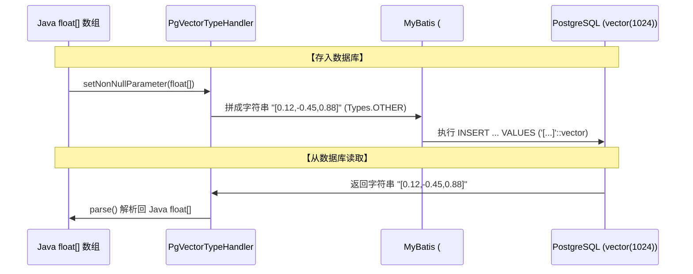

# 01 - 第 0 & 1 步：环境配置、pgvector 向量支持与数据持久化层

#JMindOps #PostgreSQL #pgvector #MyBatis #Flyway

> [!NOTE] 
> 目标：搭建项目底盘，配置 Spring AI、PostgreSQL 与 pgvector 扩展，解决 Java `float[]` 数组与数据库 `vector(1024)` 字段的映射问题，完成核心表结构迁移与 MyBatis Mapper 编写。

---

## 1. 核心依赖管理 (`pom.xml`)

项目基于 **JDK 17 + Spring Boot 3.5.8 + Spring AI 1.1.0**。

```xml
<dependencyManagement>
    <dependencies>
        <!-- 统一管理 Spring AI 所有 Starter 版本 -->
        <dependency>
            <groupId>org.springframework.ai</groupId>
            <artifactId>spring-ai-bom</artifactId>
            <version>1.1.0</version>
            <type>pom</type>
            <scope>import</scope>
        </dependency>
    </dependencies>
</dependencyManagement>

<dependencies>
    <!-- Web & 安全 & AOP -->
    <dependency>
        <groupId>org.springframework.boot</groupId>
        <artifactId>spring-boot-starter-web</artifactId>
    </dependency>
    <dependency>
        <groupId>org.springframework.boot</groupId>
        <artifactId>spring-boot-starter-security</artifactId>
    </dependency>
    <dependency>
        <groupId>org.springframework.boot</groupId>
        <artifactId>spring-boot-starter-aop</artifactId>
    </dependency>

    <!-- PostgreSQL + pgvector + MyBatis + Flyway -->
    <dependency>
        <groupId>org.postgresql</groupId>
        <artifactId>postgresql</artifactId>
    </dependency>
    <dependency>
        <groupId>org.mybatis.spring.boot</groupId>
        <artifactId>mybatis-spring-boot-starter</artifactId>
        <version>3.0.3</version>
    </dependency>
    <dependency>
        <groupId>org.flywaydb</groupId>
        <artifactId>flyway-core</artifactId>
    </dependency>
    <dependency>
        <groupId>org.flywaydb</groupId>
        <artifactId>flyway-database-postgresql</artifactId>
    </dependency>

    <!-- Spring AI 模型驱动 -->
    <dependency>
        <groupId>org.springframework.ai</groupId>
        <artifactId>spring-ai-starter-model-deepseek</artifactId>
    </dependency>
    <dependency>
        <groupId>org.springframework.ai</groupId>
        <artifactId>spring-ai-starter-model-zhipuai</artifactId>
    </dependency>
    <dependency>
        <groupId>org.springframework.ai</groupId>
        <artifactId>spring-ai-starter-model-google-genai</artifactId>
    </dependency>
</dependencies>
```

---

## 2. 核心配置文件 (`application.yaml`)

```yaml
spring:
  application:
    name: jmindops
  datasource:
    url: ${SPRING_DATASOURCE_URL:jdbc:postgresql://127.0.0.1:5432/jmindops}
    username: ${SPRING_DATASOURCE_USERNAME:postgres}
    password: ${SPRING_DATASOURCE_PASSWORD:postgres}
    driver-class-name: org.postgresql.Driver
  flyway:
    enabled: true
    locations: classpath:db/migration
    baseline-on-migrate: true
    baseline-version: 0
  ai:
    deepseek:
      api-key: ${DEEPSEEK_API_KEY:}
      base-url: ${DEEPSEEK_BASE_URL:https://api.deepseek.com}
      chat:
        options:
          model: deepseek-chat
    zhipuai:
      api-key: ${ZHIPUAI_API_KEY:}
      base-url: ${ZHIPUAI_BASE_URL:https://open.bigmodel.cn/api/paas}
      chat:
        options:
          model: glm-4.6
    google:
      genai:
        api-key: ${GOOGLE_GENAI_API_KEY:}
        chat:
          options:
            model: gemini-2.5

mybatis:
  type-aliases-package: com.kama.jmindops.model.entity
  mapper-locations: classpath:mapper/*.xml
  type-handlers-package: com.kama.jmindops.typehandler

rag:
  embedding:
    base-url: ${RAG_EMBEDDING_BASE_URL:http://localhost:11434}
    model: ${RAG_EMBEDDING_MODEL:bge-m3}
    request-timeout-seconds: 30
```

---

## 3. 核心桥梁：PostgreSQL 向量类型转换器 (`PgVectorTypeHandler`)

### ❓ 为什么需要 TypeHandler？
- **Java 端**：模型输出的向量是 `float[]` 数组，例如 `[0.12, -0.45, 0.88]`；
- **数据库端**：PostgreSQL 安装 `pgvector` 后使用 `vector(1024)` 自定义类型；
- **JDBC 限制**：JDBC 不认识 `vector` 类型，直接传入 `float[]` 会报 `PSQLException`。

### 🔄 转换流程图


### 💻 源码实现 (`PgVectorTypeHandler.java`)
```java
package com.kama.jmindops.typehandler;

import org.apache.ibatis.type.BaseTypeHandler;
import org.apache.ibatis.type.JdbcType;
import org.apache.ibatis.type.MappedJdbcTypes;
import org.apache.ibatis.type.MappedTypes;
import java.sql.*;

@MappedJdbcTypes(JdbcType.OTHER)
@MappedTypes(float[].class)
public class PgVectorTypeHandler extends BaseTypeHandler<float[]> {

    @Override
    public void setNonNullParameter(PreparedStatement ps, int i, float[] parameter, JdbcType jdbcType) throws SQLException {
        StringBuilder sb = new StringBuilder("[");
        for (int j = 0; j < parameter.length; j++) {
            sb.append(parameter[j]);
            if (j < parameter.length - 1) sb.append(',');
        }
        sb.append(']');
        ps.setObject(i, sb.toString(), Types.OTHER);
    }

    @Override
    public float[] getNullableResult(ResultSet rs, String columnName) throws SQLException {
        return parse(rs.getString(columnName));
    }

    @Override
    public float[] getNullableResult(ResultSet rs, int columnIndex) throws SQLException {
        return parse(rs.getString(columnIndex));
    }

    @Override
    public float[] getNullableResult(CallableStatement cs, int columnIndex) throws SQLException {
        return parse(cs.getString(columnIndex));
    }

    private float[] parse(String vectorText) {
        if (vectorText == null) return null;
        vectorText = vectorText.replace("[", "").replace("]", "");
        if (vectorText.isBlank()) return new float[0];
        String[] parts = vectorText.split(",");
        float[] arr = new float[parts.length];
        for (int i = 0; i < parts.length; i++) {
            arr[i] = Float.parseFloat(parts[i]);
        }
        return arr;
    }
}
```

---

## 4. 数据库表迁移脚本 (`V1__baseline_schema.sql`)

```sql
CREATE EXTENSION IF NOT EXISTS vector;

-- 1. 智能体定义表
CREATE TABLE IF NOT EXISTS agent (
    id UUID PRIMARY KEY DEFAULT gen_random_uuid(),
    name TEXT NOT NULL,
    description TEXT,
    system_prompt TEXT,
    model TEXT,
    allowed_tools JSONB,
    allowed_kbs JSONB,
    chat_options JSONB,
    created_at TIMESTAMP NOT NULL DEFAULT NOW(),
    updated_at TIMESTAMP NOT NULL DEFAULT NOW()
);

-- 2. 会话表与消息表
CREATE TABLE IF NOT EXISTS chat_session (
    id UUID PRIMARY KEY DEFAULT gen_random_uuid(),
    agent_id UUID REFERENCES agent(id) ON DELETE SET NULL,
    title TEXT,
    created_at TIMESTAMP NOT NULL DEFAULT NOW(),
    updated_at TIMESTAMP NOT NULL DEFAULT NOW()
);

CREATE TABLE IF NOT EXISTS chat_message (
    id UUID PRIMARY KEY DEFAULT gen_random_uuid(),
    session_id UUID NOT NULL REFERENCES chat_session(id) ON DELETE CASCADE,
    role TEXT NOT NULL, -- user, assistant, tool, system
    content TEXT,
    metadata JSONB,
    created_at TIMESTAMP NOT NULL DEFAULT NOW(),
    updated_at TIMESTAMP NOT NULL DEFAULT NOW()
);

-- 3. 知识库与 1024 维切片表
CREATE TABLE IF NOT EXISTS chunk_bge_m3 (
    id UUID PRIMARY KEY DEFAULT gen_random_uuid(),
    kb_id UUID NOT NULL,
    doc_id UUID NOT NULL,
    content TEXT NOT NULL,
    metadata JSONB,
    embedding VECTOR(1024) NOT NULL,
    created_at TIMESTAMP NOT NULL DEFAULT NOW(),
    updated_at TIMESTAMP NOT NULL DEFAULT NOW()
);

-- 向量索引加速 (IVFFlat / HNSW)
CREATE INDEX IF NOT EXISTS idx_chunk_embedding
    ON chunk_bge_m3 USING ivfflat (embedding vector_l2_ops) WITH (lists = 100);
```

---

## 5. 向量检索 Mapper 实现 (`ChunkBgeM3Mapper.xml`)

```xml
<!-- 向量相似度检索：使用 pgvector 的 <-> 欧氏距离操作符排序 -->
<select id="similaritySearch" resultMap="BaseResultMap">
    SELECT id, kb_id, doc_id, content, metadata, embedding, created_at, updated_at
    FROM chunk_bge_m3
    WHERE kb_id = CAST(#{kbId} AS uuid)
    ORDER BY embedding &lt;-&gt; #{vectorLiteral}::vector
    LIMIT #{limit}
</select>

<!-- 关键词检索：ILIKE 模糊匹配 -->
<select id="keywordSearch" resultMap="BaseResultMap">
    SELECT id, kb_id, doc_id, content, metadata, embedding, created_at, updated_at
    FROM chunk_bge_m3
    WHERE kb_id = CAST(#{kbId} AS uuid)
      AND content ILIKE CONCAT('%', #{keyword}, '%')
    LIMIT #{limit}
</select>
```
