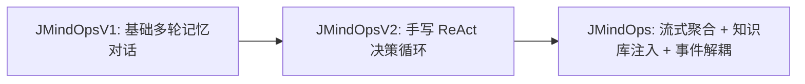
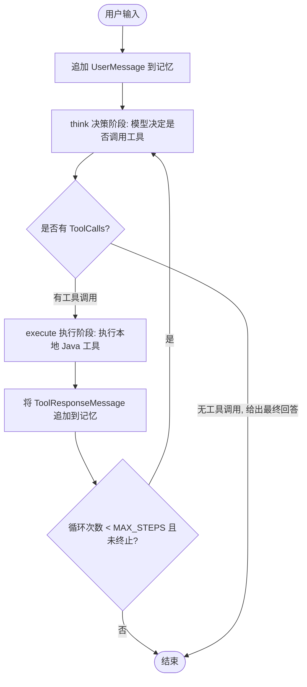

# 02 - 第 2 步：Agent 核心演进（V1 对话 -> V2 ReAct -> JMindOps 瞬态运行时）

#JMindOps #ReAct #Agent #SpringAI #Streaming

> [!NOTE] 
> 目标：理解大模型如何从单轮/多轮聊天机器人，演进为具备自主推理、工具调用循环（ReAct）与流式推流能力的智能体运行时。

---

## 1. 状态机定义 (`AgentState.java`)

```java
package com.kama.jmindops.agent;

public enum AgentState {
    IDLE,       // 空闲状态
    PLANNING,   // 规划中
    THINKING,   // 思考与决策中（调用 LLM 决策下一步动作）
    EXECUTING,  // 工具执行中
    FINISHED,   // 任务完成
    ERROR       // 异常退出
}
```

---

## 2. 演进路线



### ① V1：基于 `MessageWindowChatMemory` 的多轮对话
- 维护滑动窗口记忆（默认保留 20 条）；
- 将用户消息 `UserMessage` 追加到记忆，构造 `Prompt` 调用 `ChatClient`，将 `AssistantMessage` 存回记忆。

### ② V2：ReAct（Reasoning + Acting）思考-执行循环
核心设计：**关闭 Spring AI 内部自动工具调用，接管 ReAct 控制流**。

```java
this.chatOptions = DefaultToolCallingChatOptions.builder()
        .internalToolExecutionEnabled(false) // 👈 关键点：关闭自动执行
        .build();
this.toolCallingManager = ToolCallingManager.builder().build();
```

#### ReAct 循环时序：


#### `step()` 与 Agent 循环实现：
```java
protected void step() {
    if (think()) {
        execute(); // 有工具调用 -> 执行工具并更新记忆 -> 准备下一轮思考
    } else {
        agentState = AgentState.FINISHED; // 无工具调用 -> 任务结束
    }
}

public String chat(String userInput) {
    chatMemory.add(sessionId, new UserMessage(userInput));
    
    // Agent Loop（上限 20 次，防死循环）
    for (int i = 0; i < MAX_STEPS && agentState != AgentState.FINISHED; i++) {
        step();
    }
    return getLatestAssistantMessage();
}
```

---

## 3. 生产级 `JMindOps.java`：流式打字与事件解耦

对比 V2，企业级 `JMindOps` 增加了两个关键能力：

### ① 流式调用与工具参数聚合
流式输出时，如果大模型决定调用工具，工具的参数 JSON 是分片吐出的。`think()` 方法通过 Reactor `Flux` 进行动态拼接：
```java
reactor.core.publisher.Flux<ChatResponse> responseFlux = this.chatClient
        .prompt(prompt)
        .system(thinkPrompt)
        .toolCallbacks(this.availableTools.toArray(new ToolCallback[0]))
        .stream() // 👈 流式调用
        .chatResponse();

responseFlux.doOnNext(chunk -> {
    // 文本分片：发布实时事件供前端打字机展示
    if (output.getText() != null) {
        eventPublisher.publishEvent(new AgentMessageChunkEvent(this, chatSessionId, generationId, output.getText()));
    }
    // 工具分片：累加 JSON 参数
    if (output.getToolCalls() != null) {
        // 拼接 toolCallArguments...
    }
}).blockLast();
```

### ② `eventPublisher` 事件驱动解耦
- **`AgentMessageChunkEvent`**：每收到一个 Token 分片时发布，驱动前端 SSE 打字机；
- **`AgentMessageGeneratedEvent`**：完整消息生成完毕后发布，携带 Token 消耗、模型名、耗时（`costTime`），由监听器负责持久化落库。
