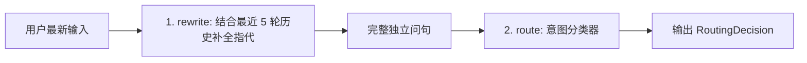

# 03 - 第 3 步：意图路由与问题改写（RouterAgent + Intent 分类）

#JMindOps #RouterAgent #QueryRewrite #PromptEngineering

> [!NOTE] 
> 目标：解决多轮对话中的“主语指代丢失”问题，以及“全量挂载工具导致大模型幻觉与 Token 浪费”的问题。

---

## 1. 为什么需要 RouterAgent？

1. **痛点 1（指代不明）**：用户第 1 轮问“*JMindOps 支持哪些数据库？*”，第 2 轮问“*那它怎么配置？*”。若直接将第 2 句拿去搜索，因为缺少主语“JMindOps”，检索准确率极低。
2. **痛点 2（工具冲突与幻觉）**：若无脑挂载所有工具，用户哪怕只是简单打招呼“*你好*”，大模型也有可能产生幻觉去调用数据库或邮件工具，增加延迟并浪费 Token。

---

## 2. 意图枚举 (`RoutingDecision.java`)

```java
package com.kama.jmindops.agent;

public enum RoutingDecision {
    WEATHER("天气专家", "专精于查询各地天气信息的助手。"),
    RAG("知识库专家", "专精于从本地文档知识库中搜索答案的助手。"),
    MCP("外部系统操作专家", "专精于使用 MCP 协议调用外部系统的助手。"),
    CHAT("闲聊助理", "日常闲聊助手。不需要调用任何外部工具。");

    private final String roleName;
    private final String description;

    RoutingDecision(String roleName, String description) {
        this.roleName = roleName;
        this.description = description;
    }
}
```

---

## 3. RouterAgent 核心实现 (`RouterAgent.java`)



### ① 查询改写 (`rewrite`)
```java
public String rewrite(String sessionId, String userMessage) {
    List<ChatMessageDTO> history = chatMessageFacadeService.getChatMessagesBySessionIdRecently(sessionId, 5);
    if (history == null || history.isEmpty()) return userMessage;

    String promptText = """
        你是一个对话意图重写器（Query Rewriter）。
        基于以下最近几轮的对话历史，将用户的最新输入重写为一句完整、独立、可以直接理解的问句。
        【要求】
        1. 如果输入本身完整，原样返回。
        2. 如果省略了主语、地点等，结合历史补全。
        3. 只输出重写后的句子，不要包含任何多余解释！
        """;

    String response = chatClient.prompt()
            .system(String.format(promptText, historyText, userMessage))
            .call()
            .content();
    return (response != null && !response.isBlank()) ? response.trim() : userMessage;
}
```

### ② 意图分类 (`route`)
```java
public RoutingDecision route(String userMessage) {
    String promptText = """
        你是一个意图识别分析器。将用户输入分类到以下唯一的意图之一：
        1. WEATHER：询问天气
        2. RAG：询问专业文档知识
        3. MCP：操作外部数据库、文件等
        4. CHAT：日常闲聊或通用问答
        仅输出意图英文单词。
        """;

    String response = chatClient.prompt()
            .system(String.format(promptText, userMessage))
            .call()
            .content();

    String clean = response.trim().toUpperCase();
    if (clean.contains("WEATHER")) return RoutingDecision.WEATHER;
    if (clean.contains("RAG")) return RoutingDecision.RAG;
    if (clean.contains("MCP")) return RoutingDecision.MCP;
    return RoutingDecision.CHAT;
}
```
