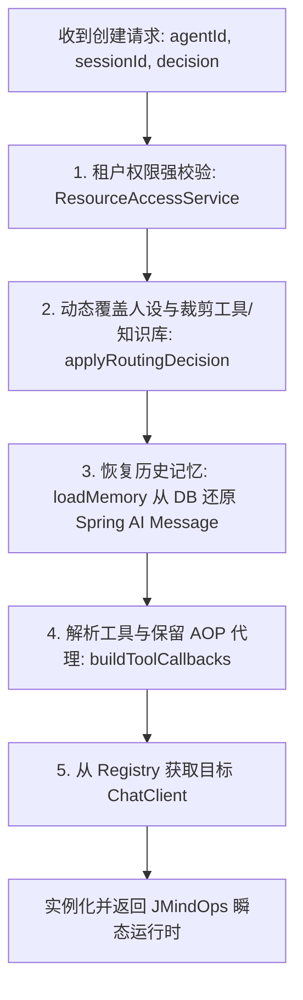

# 04 - 第 3 步扩展：JMindOpsFactory 动态工厂与无状态设计

#JMindOps #DesignPattern #Factory #Stateless #SpringSecurity

> [!NOTE] 
> 深度剖析：为什么 Agent 运行时必须采用“无状态动态工厂”按需装配，而不是在内存中常驻单例或 Session 对象？

---

## 1. 为什么必须用“动态工厂”？

在传统开发中，Service 通常是单例（`@Service`）。但在 Agent 架构中：
1. **模型多变**：不同 Agent 可能配置了 `deepseek-chat`、`glm-4.6` 或 `gemini-2.5`；
2. **意图动态裁剪**：同一个 Agent，第 1 轮闲聊（清空工具），第 2 轮查数据库（挂载 MCP 工具）；
3. **安全与租户隔离**：必须实时核对当前登录用户是否有权限访问目标 Agent、Session 和知识库；
4. **无状态与集群扩展（Stateless Architecture）**：
   - 若在 JVM 内存中常驻每个用户的 `JMindOps` 实例，服务器重启状态全丢，且无法做微服务多实例负载均衡；
   - **将 PostgreSQL 数据库作为唯一真理源（Single Source of Truth）**，每次发消息时由工厂读取 DB 历史快速装配，执行完毕后由 JVM GC 释放。

---

## 2. 动态工厂装配流水线



---

## 3. 核心装配方法解析 (`JMindOpsFactory.java`)

### ① 工具装配与 AOP 代理保留
> [!IMPORTANT]
> 注册给 Spring AI 的 `ToolCallback` 必须传入 Spring 容器中已经注入的代理 Bean 实例，不能调用 `new Tool()`。否则挂在工具上的 AOP 审批切面将无法生效！

```java
private List<ToolCallback> buildToolCallbacks(List<Tool> runtimeTools, RoutingDecision decision, ...) {
    List<ToolCallback> callbacks = new ArrayList<>();
    for (Tool tool : runtimeTools) {
        // tool 是 Spring 注入进来的代理 Bean
        Object target = resolveToolTarget(tool); 
        ToolCallback[] toolCallbacks = MethodToolCallbackProvider.builder()
                .toolObjects(target)
                .build()
                .getToolCallbacks();
        callbacks.addAll(Arrays.asList(toolCallbacks));
    }
    return callbacks;
}
```

### ② 动态人设与工具裁剪 (`applyRoutingDecision`)
```java
private void applyRoutingDecision(Agent agent, AgentDTO agentConfig, RoutingDecision decision) {
    if (decision == null) return;

    // 1. 动态覆盖人设
    String routedPrompt = String.format("【专家角色：%s】\n角色设定：%s\n\n=== 基础设定 ===\n%s",
            decision.getRoleName(), decision.getDescription(), agent.getSystemPrompt());
    agent.setSystemPrompt(routedPrompt);

    // 2. 按意图裁剪工具，避免大模型幻觉
    if (decision == RoutingDecision.CHAT) {
        agentConfig.setAllowedTools(Collections.emptyList());
        agentConfig.setAllowedKbs(Collections.emptyList());
    } else if (decision == RoutingDecision.WEATHER) {
        agentConfig.setAllowedTools(filterToolsByName(agentConfig, "weather"));
        agentConfig.setAllowedKbs(Collections.emptyList());
    } else if (decision == RoutingDecision.RAG) {
        agentConfig.setAllowedTools(filterToolsByName(agentConfig, "document"));
    }
}
```
