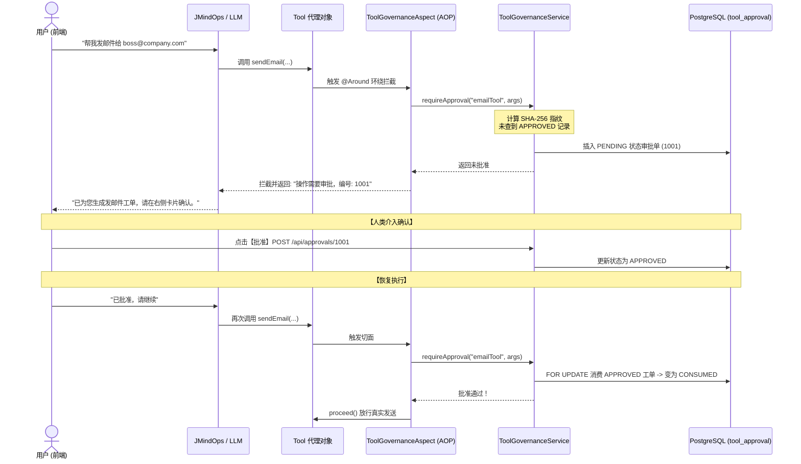

# 06 - 第 5 步：工具生态与 AOP 人机协同审批治理

#JMindOps #SpringAOP #ToolGovernance #HumanInTheLoop #Security

> [!NOTE] 
> 目标：防止 AI Agent 在自主调用高风险工具（如发邮件、写数据库）时产生幻觉造成破坏。实现声明式注解拦截、SHA-256 参数指纹防篡改与 PostgreSQL 行级锁一次性原子消费。

---

## 1. 人机协同审批全流程



---

## 2. 声明式注解与 AOP 切面实现

### ① 工具方法标注注解 (`EmailTools.java`)
```java
@Component
@ConditionalOnProperty(name = "app.tools.email.enabled", havingValue = "true")
public class EmailTools implements Tool {
    @org.springframework.ai.tool.annotation.Tool(name = "sendEmail")
    @RequiresToolApproval(riskLevel = "HIGH") // 👈 标记高风险
    public String sendEmail(String to, String subject, String content) {
        emailService.sendEmailAsync(to, subject, content);
        return "邮件发送成功";
    }
}
```

### ② 环绕拦截切面 (`ToolGovernanceAspect.java`)
```java
@Aspect
@Component
@RequiredArgsConstructor
public class ToolGovernanceAspect {
    private final ToolGovernanceService toolGovernanceService;

    @Around("@annotation(toolAnnotation)")
    public Object govern(ProceedingJoinPoint joinPoint, Tool toolAnnotation) throws Throwable {
        MethodSignature signature = (MethodSignature) joinPoint.getSignature();
        RequiresToolApproval approval = signature.getMethod().getAnnotation(RequiresToolApproval.class);
        String toolName = toolAnnotation.name().isBlank() ? signature.getMethod().getName() : toolAnnotation.name();

        if (approval != null) {
            ToolGovernanceService.ApprovalDecision decision = 
                    toolGovernanceService.requireApproval(toolName, joinPoint.getArgs(), approval.riskLevel());
            // 未批准：拦截执行
            if (!decision.approved()) {
                return "操作需要人工审批，审批编号：" + decision.approvalId() + "。请在界面批准后让用户确认继续。";
            }
        }

        // 已批准：放行执行真实方法
        return joinPoint.proceed();
    }
}
```

---

## 3. 防篡改与一次性消费机制 (`ToolGovernanceService.java`)

### ① SHA-256 参数指纹防篡改
```java
String fingerprint = sha256("v2|" + user.id() + "|" + sessionId + "|"
        + toolName + "|" + riskLevel + "|" + argumentsJson);
```
大模型若篡改入参中哪怕一个字符，指纹就会不匹配，无法复用已批准的工单。

### ② PostgreSQL 行级锁一次性原子消费 (One-Shot)
```sql
WITH candidate AS (
    SELECT id FROM tool_approval
    WHERE user_id = CAST(? AS uuid)
      AND session_id = CAST(? AS uuid)
      AND tool_name = ? AND fingerprint = ?
      AND status = 'APPROVED' AND expires_at > NOW()
    ORDER BY decided_at DESC NULLS LAST
    LIMIT 1
    FOR UPDATE SKIP LOCKED -- 👈 行级排他锁
)
UPDATE tool_approval approval
SET status = 'CONSUMED', consumed_at = NOW() -- 👈 状态变更为已消费，防重放
FROM candidate
WHERE approval.id = candidate.id
  AND approval.status = 'APPROVED'
RETURNING approval.id::text;
```
